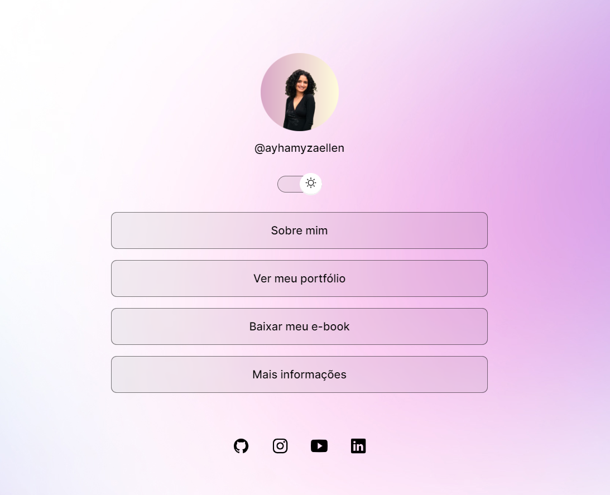
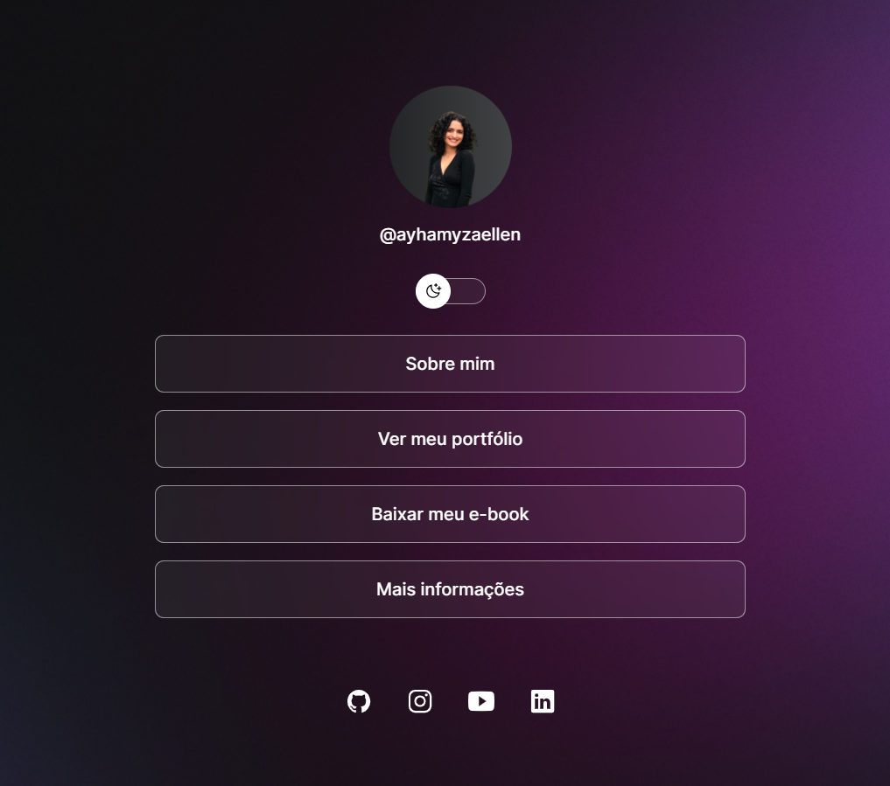

<h1 align="center"> DevLinks </h1>
 

O DevLinks é um agregador de links para usar como cartão de visitas online.

[Acesse o projeto finalizado, online](https://ayhamyza.github.io/devLinks/)

 

  <a href="#-tecnologias"> 💻Tecnologias utilizadas</a>

 

  
  

## 🚀 Tecnologias

Esse projeto foi desenvolvido com as seguintes tecnologias:

- HTML e CSS
- JavaScript
- Git e Github
- Figma

